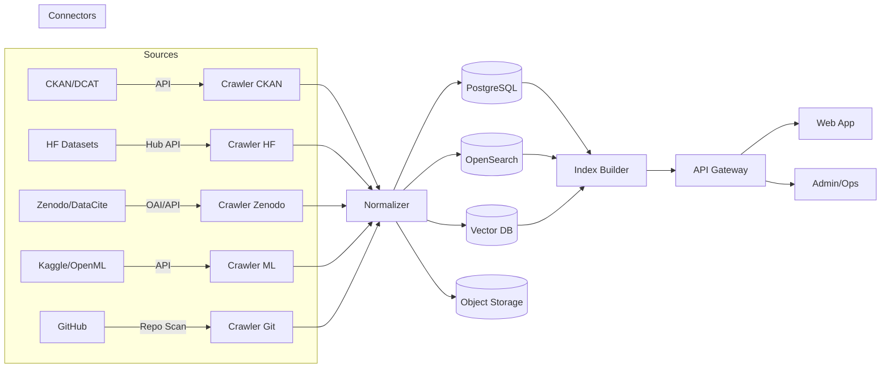

## 全领域开放数据集索引平台（设计文档）

> TL;DR：面向全领域的数据集搜索、发现与访问平台，统一采集与标准化元数据，提供高质量检索、推荐与合规模块，支持开放 API 与可观测运维。

---

## 目录

- **愿景与范围**
- **目标用户与价值**
- **核心功能**
- **系统架构**
- **数据模型与元数据标准**
- **数据源采集与规范化**
- **搜索、排序与推荐**
- **API 设计（REST/GraphQL）**
- **权限、合规与安全**
- **质量评估与治理**
- **运营指标与评测**
- **部署与环境**
- **可观测性与运维**
- **性能与容量规划**
- **国际化与可访问性**
- **里程碑与路线图**
- **贡献指南**
- **许可证**

---

## 愿景与范围

- **愿景**：打造覆盖学术、政府、产业、AI/ML 社区在内的全领域开放数据集索引平台，降低数据发现门槛，提升数据复用效率。
- **范围**：
  - 采集开放门户（如 CKAN/DCAT）、学术存储（DataCite/Zenodo）、ML 社区（Hugging Face Datasets、OpenML、Kaggle）、公共代码平台（GitHub）等的数据集元数据。
  - 提供统一的元数据标准与质量评估，支持多语种检索与语义推荐。
  - 不托管大型文件本体，指向原数据源；在允许的情况下缓存快照与小样本预览。

## 目标用户与价值

- **研究人员/工程师**：快速定位可用数据集、查看许可与质量信号、比较相似数据集。
- **数据平台/产品经理**：洞察领域覆盖与供给缺口，支持专题运营与合集策划。
- **数据提供方**：通过提交入口统一上架，获得更多曝光与使用反馈。

## 核心功能

- **多源采集**：连接 CKAN/DCAT、Hugging Face、Zenodo、OpenML、Kaggle、GitHub、政府与机构开放门户。
- **元数据标准化**：对齐 DCAT、Schema.org Dataset、DataCite/Dublin Core，统一核心字段与可选扩展。
- **强检索**：关键词检索、向量语义检索、混合检索、筛选（领域、许可、更新时间、大小、格式、来源）。
- **排序与推荐**：BM25 + 向量召回 + 学习排序；相似数据集、同源系列、热门趋势。
- **质量与合规**：完整度评分、可用性评分、更新新鲜度、Licensing 校验、PII/敏感性提示。
- **可视化与预览**：小样本表格预览、字段统计、格式分布、许可徽章。
- **开放 API**：REST/GraphQL，限流与审计；Webhook/回调；元数据导出。
- **提交与纠错**：用户提交新数据源、纠错建议与标签治理。

## 系统架构

### 组件划分

- **Connector & Crawler**：多源连接器（CKAN、DCAT、HF、Zenodo 等）+ 抓取调度。
- **Normalizer**：元数据清洗、标准映射、实体对齐（去重/合并）。
- **Storage**：
  - 关系库（PostgreSQL/MySQL）存主数据与关系。
  - 检索引擎（OpenSearch/Elasticsearch）存倒排与结构化可检索字段。
  - 向量库（FAISS/Milvus/pgvector）存嵌入向量。
  - 对象存储（S3/OSS/MinIO）存小样本与快照。
- **Indexing**：离线/增量构建倒排与向量索引，触发器与变更流。
- **API 网关**：REST/GraphQL、认证、鉴权、限流、审计。
- **Web 应用**：搜索页、详情页、比较页、专题与合集、提交/纠错。
- **Admin & Ops**：质量面板、采集监控、任务编排、指标看板。

### 架构示意（Mermaid）



## 数据模型与元数据标准

### 采用与对齐的标准

- DCAT 2.0、Dublin Core、DataCite、Schema.org Dataset。
- 许可标准对齐 SPDX；领域与主题参考 UNESCO/ACM CCS 与自定义词表。

### 核心实体

- **Dataset**：数据集主实体。
- **Distribution**：数据分发/下载项（格式、链接、校验、大小）。
- **Organization/Author**：组织或作者。
- **Source**：来源平台与抓取策略。
- **License**：许可对象与约束。
- **Tag/Topic**：主题与标签。

### 核心字段（建议）

| 字段 | 说明 | 示例 |
| --- | --- | --- |
| id | 全局唯一 ID | ds_zenodo_123456 |
| title | 标题 | Global Land Cover |
| description | 描述 | 高分辨率土地覆盖数据 |
| source | 来源平台 | zenodo, hf, ckan |
| source_id | 源端标识 | 123456 |
| url | 详情页链接 | https://... |
| created_at | 首次发布时间 | 2020-01-01 |
| updated_at | 最近更新时间 | 2024-06-30 |
| languages | 语种 | ["en", "zh"] |
| topics | 主题 | ["climate", "nlp"] |
| license | 许可 | CC-BY-4.0 |
| distributions | 分发列表 | csv/json/parquet |
| stats | 统计 | 行数、文件数、大小 |
| quality | 质量指标 | 完整度、可用性、新鲜度 |
| embeddings | 向量 | 768d |

### 去重与实体对齐

- 基于规则（title 规范化、URL 指纹、作者+年份）+ 向量相似度（语义描述）做候选；
- 通过学习排序/分类器决定合并或建立“近似/相关”关系；
- 保留来源追溯链与差异字段。

## 数据源采集与规范化

### 连接器清单

- CKAN/DCAT 门户（data.gov、data.gov.uk、欧盟开放数据门户等）。
- 学术与研究：Zenodo、DataCite、Figshare、Dryad。
- 机器学习社区：Hugging Face Datasets、OpenML、Kaggle（遵守条款）。
- 代码托管：GitHub（repo 标注 dataset、data 目录扫描）。

### 调度与增量

- 周期全量 + Webhook/变更源增量（支持 ETag/Last-Modified）。
- 失败重试、指数退避、断点续传、幂等去重。

### 规范化流程

1) 字段映射与清洗；2) 语言检测与多语生成（可选）；3) 许可标准化；4) 实体对齐；5) 质量指标计算；6) 入库与索引。

## 搜索、排序与推荐

- **召回**：BM25 倒排检索（OpenSearch）+ 语义向量检索（sentence-transformers/中文模型）+ 结构化过滤。
- **融合**：基于 RRF 或学习排序融合文本匹配分数、向量相似度、质量/流行度信号。
- **重排**：Cross-Encoder 重排（可选）。
- **推荐**：相似数据集（向量近邻）、同源系列、热门趋势、协同过滤（匿名会话/公共信号）。
- **过滤与聚合**：领域、许可、来源、更新时间、格式、体量、语言；支持 Facet。

## API 设计（REST/GraphQL）

### REST（示例）

- GET `/api/v1/datasets?query=climate&topic=earth&license=cc-by-4.0&page=1&page_size=20`
- GET `/api/v1/datasets/{id}`
- GET `/api/v1/datasets/{id}/similar`
- POST `/api/v1/submit`（提交新数据源/线索）
- POST `/api/v1/feedback`（纠错与注释）

响应关键字段：`items`, `total`, `facets`, `quality`, `license`, `distributions`。

### GraphQL（示意）

```graphql
type Query {
  searchDatasets(q: String!, filters: FilterInput, page: Int, size: Int): SearchResult
  dataset(id: ID!): Dataset
  similarDatasets(id: ID!, size: Int): [Dataset]
}
```

### 认证与限流

- API Key/OAuth2；基于用户组的额度；全局与用户级限流；审计日志与指标。

## 权限、合规与安全

- **许可合规**：显示 SPDX 许可；下载需跳转源站；遵守源站条款与机器人协议。
- **隐私与敏感性**：PII 检测（规则+模型）、DLP 提示；标注敏感级别。
- **安全**：输入校验、资产隔离、最小权限、依赖漏洞扫描、WAF、审计追踪。

## 质量评估与治理

- **完整度**：字段缺失率、文档长度、分发可用性。
- **可用性**：链接可达、下载成功率、校验和一致性。
- **新鲜度**：源端更新时间、最近抓取时间、变更频率。
- **社区信号**：引用/Star（可选）、下载量、使用案例。
- 提供可解释的质量分数与指标面板。

## 运营指标与评测

- **检索效果**：NDCG@10、MRR、Recall@k（人工标注集）。
- **使用行为**：查询转化率、详情页点击、出站跳转成功率。
- **覆盖度**：来源覆盖、主题覆盖、增量速度、去重率。
- **稳定性**：抓取任务成功率、API P95 延迟与错误率。

## 部署与环境

- 容器化：Docker 镜像；Kubernetes 部署；Helm/ArgoCD。
- 依赖：PostgreSQL、OpenSearch、向量库（Milvus/pgvector/FAISS）、对象存储（S3 兼容）。
- 配置：环境变量/Secret 管理；分环境（dev/staging/prod）。

## 可观测性与运维

- 指标：Prometheus 指标（采集速率、队列积压、索引耗时、API QPS/延迟）。
- 日志：结构化日志 + 集中检索；异常告警。
- Trace：OpenTelemetry 分布式追踪（抓取→规范化→索引→API）。
- 后台：任务编排与重试、失败样本归档、手动重跑入口。

## 性能与容量规划

- 检索：冷热分层索引；并行查询；字段裁剪；分页与游标；缓存（CDN/边缘）。
- 索引：批量写入、异步刷新、分片与副本规划；向量 ANN 参数调优。
- 存储：按来源与主题分区；TTL 策略；大对象外链与按需缓存。

## 国际化与可访问性

- 多语言 UI 与元数据（自动翻译+人工修订）。
- a11y：键盘导航、对比度、ARIA 标签。

## 里程碑与路线图

- **MVP（0.1）**：HF/Zenodo/CKAN 三源接入；基本检索与详情；质量评分 v0。
- **Beta（0.2-0.3）**：混合检索+重排；相似推荐；提交与纠错；Ops 面板。
- **1.0**：更多来源（Kaggle/OpenML/GitHub）；多语支持；评测闭环；合规模块完善。

## 贡献指南

1. 提交 Issue 描述数据源/功能建议；
2. Fork 新分支；遵循代码与文档规范；
3. 提交 PR，包含测试与文档更新；
4. 通过 Review 与 CI 后合入。

## 许可证

- 文档与代码建议采用 `Apache-2.0` 或 `MIT`；
- 注意：索引到的外部数据集受其各自许可与条款约束。

---

## 快速开始（占位）

```bash
# 克隆与初始化（示例）
git clone <repo>
cd <repo>
make dev # 或 docker-compose up
```

## 附录

- 术语表：Dataset/Distribution/License/Facet/Embedding/ANN。
- 参考标准：DCAT、Schema.org、DataCite、SPDX、OpenSearch。


